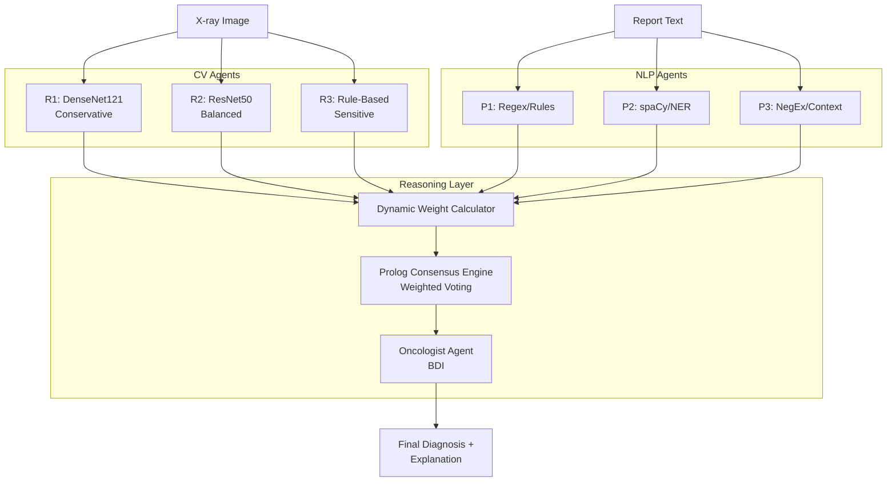

# BDI Multi-Agent System for Lung Nodule Classification from Chest X-ray Reports

**University of Genoa — NLP and SDAI Project**
**Author:** Sepehr Khodadadi Hosseinabadi ([6660699@studenti.unige.it](mailto:6660699@studenti.unige.it))
**Repository:** [github.com/sepehrkdi/lung_nodule_mas](https://github.com/sepehrkdi/lung_nodule_mas)

This project implements a **Belief-Desire-Intention (BDI) Multi-Agent System (MAS)** for extracting and fusing diagnostic evidence from chest X-ray images and radiology reports. It combines three AI paradigms within a multi-agent architecture:

1. **Natural Language Processing (NLP):** Extracting structured nodule attributes (size, location, texture, descriptors), detecting mentions, and determining negation/uncertainty status from free-text radiology reports.
2. **Computer Vision (CV):** Obtaining nodule suspicion scores from chest X-ray images using the `TorchXRayVision` library, leveraging DenseNet-121 (CheXNet) and ResNet models pretrained on massive chest X-ray datasets.
3. **Symbolic Reasoning:** Combining the outputs of multiple NLP and CV agents using first-order logic rules encoded in Prolog, implementing weighted consensus, conflict detection, and binary classification (0=benign, 1=malignant).

---

## Key Contributions

1. A BDI multi-agent system with **7 agent instances** across 3 agent types, communicating via FIPA-ACL message passing.
2. An evaluation methodology where NLP agents must infer a diagnosis from observational data (`FINDINGS`) while being evaluated against the radiologist's explicit diagnosis (`IMPRESSION`).
3. A custom NLP pipeline implementing: report section splitting with section weighting, entity and attribute extraction, measurement normalization, and NegEx-style negation and uncertainty detection.
4. A **dependency-anchored frame building** module with multi-pass traversal that handles long-distance dependencies in complex clinical constructions, utilizing clausal modifiers (`acl`, `relcl`, `appos`) and participial chain scanning.
5. **Graded uncertainty quantification** that distinguishes aleatory uncertainty (inherent text ambiguity) from epistemic uncertainty (knowledge gaps), providing continuous scores rather than categorical labels.
6. A **Prolog-based consensus mechanism** that performs weighted voting, disagreement detection, conflict resolution, and binary classification with explanation generation.
7. A **dynamic, per-case weight assignment** mechanism that adjusts agent reliability weights based on the information richness of the available radiology images and pathology reports.
8. A multi-factor **NLP-richness scoring** function that combines MeSH metadata, entity detection, negation awareness, and structural completeness for evaluation case selection.
9. An **anatomically-calibrated size estimation** method using blob detection with a chest X-ray field-of-view model, replacing naïve pixel-dimension heuristics.
10. A **size-provenance framework** where agents return `(size_mm, size_source)` tuples and the consensus engine applies a 50% weight penalty to agents with unknown or undetected sizes.
11. A **continual learning** mechanism that adapts agent base weights based on retrospective diagnostic feedback.
12. An end-to-end evaluation on real clinical reports using NLP-derived binary ground truth for system-level classification.

---

## Architecture

The system emulates the real-world clinical workflow in which independent specialists generate domain-specific reports that are subsequently integrated by a coordinating clinician to inform diagnosis and management.



---

## Agents

### Radiologist Agents (Computer Vision)

The CNN-based agents (R1, R2) utilize the `TorchXRayVision` library employing the DenseNet-121 architecture (CheXNet). No additional CV training is performed; the system relies on robust frozen weights.

| Agent | Style | Base Weight | Behavior |
|-------|-------|:-----------:|----------|
| **R1** | Conservative | 1.0 | DenseNet121, high specificity, fewer false positives |
| **R2** | Balanced | 1.0 | ResNet50, standard operating point |
| **R3** | Rule-Based | 0.7 | Anatomically-calibrated blob detection + Lung-RADS rules |

**R3: Anatomically-Calibrated Size Estimation.** The rule-based radiologist applies Lung-RADS size/texture rules to estimate malignancy probability. Instead of naïve pixel-dimension heuristics (which produce clinically implausible values like 125mm), R3 implements blob detection calibrated to a standard PA chest X-ray field of view (300mm):

```
d_mm = (2√(A_px / π) / H_px) × 300
```

On real NLMCXR images, this produces estimates of 5.1mm, 9.6mm, and 52.4mm for different views — clinically plausible values compared to the 124.8mm produced by the old heuristic.

### Pathologist Agents (NLP)

The term "Pathologist" is used metaphorically for agents that analyze textual evidence. Each agent implements a different NLP strategy:

| Agent | Approach | Base Weight | Focus |
|-------|----------|:-----------:|-------|
| **P1** | Regex/Rules | 0.8 | Robust patterns, section-based extraction |
| **P2** | spaCy/NER | 0.9 | Dependency parsing, frame building (scispaCy) |
| **P3** | NegEx/Context | 0.85 | Negation and uncertainty detection |

**Explicit Unknown-Size Handling.** All Pathologist agents return `(size_mm, size_source)` tuples. When no measurement is detected, agents return `(None, "unknown")` — the consensus engine then reduces these agents' weights by 50%.

### Oncologist Agent (Consensus)

- **Role**: Coordinator and decision maker.
- **Logic**: SWI-Prolog (via PySwip).
- **Functions**:
  1. Dynamic weight computation from per-case information richness
  2. Weighted voting: `P_final = Σ(ŵᵢ · cᵢ · pᵢ) / Σ(ŵᵢ · cᵢ)`
  3. Binary classification (threshold at 0.5)
  4. Disagreement detection (σ > 0.08)
  5. Conflict resolution strategies (6 rules)
  6. Explanation generation
  7. Continual learning (weight adaptation from feedback)

---

## NLP Pipeline

The NLP pipeline follows the radiology NLP architecture described by Pons et al. and is distributed across the three Pathologist agents.

### Report Section Splitting
Reports are segmented with section weighting: `FINDINGS` (1.0), `INDICATION` (0.5), `TECHNIQUE` (0.2). The `FINDINGS` section receives the highest weight as the primary source of diagnostic observations.

### Tokenization and Normalization
- **Abbreviations:** Common thoracic imaging abbreviations (RUL, GGO, CXR) expanded using a RadLex-derived dictionary.
- **Measurement normalization:** Formats like "8 mm", "0.8 cm", "8mm" are normalized to millimeters.
- **Hyphenated terms:** Medical compounds ("well-defined", "ground-glass") handled as single tokens.

### Nodule Mention Detection
A lexicon-based approach using terms derived from Fleischner Society terminology: `nodule`, `nodular`, `mass`, `lesion`, `opacity`, `pulmonary nodule`, `spiculated mass`, etc. Pathologist-2 supplements this with scispaCy's biomedical NER model.

### Attribute Extraction
Four categories forming the minimum set required by the Lung-RADS classification:
1. **Anatomical location:** Lobe references, positional terms, laterality
2. **Size mentions:** Multiple format patterns with auto unit normalization to mm
3. **Multiplicity:** Plural nodule mentions, bilateral, numeric quantifiers
4. **Descriptors:** Texture (solid, ground-glass), Margins (spiculated, lobulated), Calcification (popcorn, laminated)

### Dependency-Anchored Frame Building (Pathologist-2)

To resolve the "bag-of-words" problem in multi-finding reports, Pathologist-2 uses a **four-pass traversal** strategy:

1. **Pass 1 — Direct Modifiers:** BFS traversal of anchor's subtree for adjectives, numeric modifiers, compounds.
2. **Pass 2 — Clausal Modifiers:** Identifies clausal dependents (`acl`, `relcl`, `appos`, `advcl`) for measurement and characterization extraction.
3. **Pass 3 — Participial Chain Scanning:** Linear scan for participial verbs and measurements in comma-separated phrases.
4. **Pass 4 — Appositive Fallback:** Sentence-wide scan for unclaimed measurements.

Output is a list of structured `NoduleFinding` objects with: `anchor_text`, `size_mm`, `size_source`, `texture`, `location`, `margins`, `calcification`, `characterization`, `is_negated`, `is_uncertain`, and `extraction_paths` for interpretability.

### Negation Detection (Pathologist-3)

Implements NegEx-style negation with:
- **Pre-negation triggers:** "no", "no evidence of", "without", "negative for", "denies", "unremarkable"
- **Post-negation triggers:** "is ruled out", "unlikely", "not seen", "not identified"
- **Scope window:** 6 words, terminated by "but", "however", "although", "except"

### Uncertainty Detection

Follows the same trigger-scope mechanism with separate trigger phrases:
- **Pre-uncertainty:** "possible", "may represent", "cannot exclude", "suspicious for", "suggestive of"
- **Post-uncertainty:** "is suspected", "cannot be excluded", "should be considered"

When both negation and uncertainty triggers apply, **negation takes precedence** (following CheXpert convention).

### Graded Uncertainty Quantification

Beyond categorical labels, the system distinguishes:
- **Aleatory uncertainty:** Inherent text ambiguity (hedge phrases, conflicting evidence)
- **Epistemic uncertainty:** Incomplete knowledge (missing attributes, sparse extraction)

Combined via quadrature: `U_total = √(U_aleatory² + U_epistemic²)`

---

## Prolog-Based Consensus Mechanism

### Weighted Voting

```
P_consensus = Σ(ŵᵢ · pᵢ) / Σ(ŵᵢ)
Confidence = max(0, 1 - 3σ)
```

### Disagreement Detection & Resolution

A three-stage pipeline:

1. **Stage 1 — Detection (σ > 0.08):** Flags disagreement when agent probability std. dev. exceeds 0.08 (triggers on ≥16% probability gap).
2. **Stage 2 — Conflict Resolution:** Pattern-specific rules:
   - *Visual–Text Conflict* (P_CV > 0.65 and P_NLP < 0.35): Average probabilities, flag for radiology review
   - *Text Override* (P_NLP > 0.65 and P_CV < 0.35): Override with pathologist probability
   - *Pathologist Override* (P_NLP ≥ 0.60 and 0.35 ≤ P_CV ≤ 0.65): Prevent dilution of textual evidence
   - *CNN–NLP Agreement* (|P_CNN - P_NLP| < 0.2): 60/40 weighted combination
   - *Rule-Based Tiebreaker:* R3 as deciding agent
   - *Conservative Default:* Flag for multidisciplinary review
3. **Stage 3 — Classification (threshold 0.5):** Benign if P < 0.5, Malignant if P ≥ 0.5.

### Dynamic Per-Case Weight Assignment

Static weights cannot adapt to per-case data asymmetry. The `DynamicWeightCalculator` computes:

- **Radiology Richness** `R_rad`: Image count (0.35) + PA view presence (0.35) + Image quality proxy (0.30)
- **Pathology Richness** `R_path`: Text length (0.25) + Entity count (0.30) + Section completeness (0.20) + Certainty signal (0.25)

**Scaling formula:** `ŵᵢ = wᵢ · (λ + (1-λ) · R)` where λ=0.5 is a scale floor guaranteeing minimum 50% of base weight.

### Continual Learning

Agent base weights are updated based on diagnostic feedback:
```
w(t+1) = clamp(w(t) + η·δ, w_min, w_max)
```
where η=0.01, δ=+1 if correct, -1 if incorrect, clamped to [0.2, 3.0].

---

## User Interface

The system features a **Streamlit-based Dashboard** for interactive analysis and explainability.

### 1. Dashboard Overview
A dedicated dashboard tracks system performance, showing real-time metrics (Accuracy, Precision, Recall) and agreement statistics across the evaluation set.


### 2. Case Analysis
The core interface allows deep inspection of individual cases, visualizing both the X-ray image and the radiology report side-by-side. NLP agents highlight extracted entities directly in the report text, color-coded by certainty.


### 3. Agent Results
Each agent (3 Radiologists, 3 Pathologists) displays its individual findings, confidence, and computed dynamic weight.


### 4. Consensus & Decision Making
The Oncologist agent aggregates these findings into a final diagnosis, providing a malignancy probability and a clinical recommendation.


### 5. Explainability Features
To build trust, the system exposes its internal reasoning:

**Dynamic Weight Assignment**: Quantifies how data richness (e.g., image quality, report detail) influences each agent's vote.


**Agent Thinking Process**: A step-by-step log of the BDI reasoning loop (Perception → Deliberation → Intention).


---

## Installation

### Prerequisites
- Python 3.8+
- SWI-Prolog ([Installation Guide](https://www.swi-prolog.org/Download.html))
- `git`

### Setup
```bash
# Clone the repository
git clone https://github.com/sepehrkdi/lung_nodule_mas.git
cd lung_nodule_mas

# Create virtual environment
python -m venv venv
source venv/bin/activate  # Linux/Mac: source venv/bin/activate

# Install dependencies
pip install -r requirements.txt

# Install scispaCy model
pip install https://s3-us-west-2.amazonaws.com/ai2-s2-scispacy/releases/v0.5.1/en_core_sci_sm-0.5.1.tar.gz
```

> **Note**: `TorchXRayVision` will download pretrained weights (approx 100MB) on the first run.

## Usage

### 1. Extended Demo (Recommended)
Run the full 6-agent system on sample cases with detailed logging.
```bash
python main_extended.py --demo
```

### 2. Export Results
Generate a JSON report of the analysis.
```bash
python main_extended.py --evaluate --export results.json
```

---

## Evaluation & Ablation Framework

The system includes a comprehensive evaluation framework for rigorous validation and ablation studies.

### Quick Start

```bash
# Run full evaluation with 5-fold cross-validation
python main_extended.py --data nlmcxr --evaluate --cv-folds 5

# Run baseline comparison
python main_extended.py --data nlmcxr --run-baselines

# Compare weighting modes
python main_extended.py --evaluate --weight-mode equal
python main_extended.py --evaluate --weight-mode static

# Evaluate ALL cases (disable NLP richness filtering)
python main_extended.py --evaluate --no-filter
```

### CLI Options

| Flag | Status | Description |
|------|--------|-------------|
| `--weight-mode` | ✅ Functional | Agent weighting strategy: `dynamic`, `static`, `equal` |
| `--no-filter` | ✅ Functional | Disable NLP richness filtering (evaluate ALL cases) |
| `--cv-folds N` | ✅ Functional | Stratified k-fold cross-validation |
| `--run-baselines` | ✅ Functional | Evaluate 4 baseline predictors |
| `--consensus` | 🔧 Scaffolded | Consensus engine backend: `prolog`, `python` |
| `--no-negex` | 🔧 Scaffolded | Disable NegEx negation detection |
| `--no-dependency-parsing` | 🔧 Scaffolded | Disable dependency parsing in NLP |
| `--single-agent` | 🔧 Scaffolded | Use only one agent (ablation) |

> **Note:** "Scaffolded" flags are parsed but require additional development to fully propagate to agents. The core multi-agent architecture and evaluation framework were prioritized within the 20-day project scope.

### Baseline Predictors

| Baseline | Description |
|----------|-------------|
| **Majority Class** | Always predicts the most frequent class |
| **Random** | Random predictions with class prior |
| **Single Agent** | Individual agent predictions (R1, R2, R3, P1, P2, P3) |
| **Unweighted Majority Vote** | Simple majority across all 6 agents |
| **Static Weighted Average** | Fixed weights (no dynamic adjustment) |
| **sklearn Voting** | Industry-standard VotingClassifier |
| **Pure Python Average** | Python-only weighted average (no Prolog) |

### Ablation Categories

1. **Agent Ablations:** Test whether all 6 agents are necessary (single-modality, remove-one-agent)
2. **Weighting Ablations:** Compare dynamic vs. static vs. equal weights
3. **Symbolic Layer Ablations:** Prolog consensus vs. pure Python consensus
4. **NLP Component Ablations:** NegEx contribution, dependency parsing value

### Claim Verification Matrix

| Claim | Verification Criterion |
|-------|----------------------|
| Multi-agent > Single-agent | Accuracy difference > 0 |
| Dynamic > Static weights | Accuracy difference > 0 |
| Prolog ≈ Python consensus | \|ΔAcc\| < 0.01 |
| NegEx contribution | ΔF1 > 0 |
| Dependency parsing value | ΔF1 > 0 |
| Ensemble improves recall | Recall difference > 0 |
| System beats majority baseline | Accuracy > 84.4% (class prior) |

---

## Evaluation Results

### System Performance (500-Case Evaluation Subset)

| Metric | Score |
|--------|-------|
| **Binary Accuracy** | **76.6%** |
| Weighted Precision | 73.7% |
| Weighted Recall | 76.6% |
| Weighted F1 Score | 75.1% |
| Majority + Unanimous Agreement | 97.8% |
| Split Decisions | 2.2% |
| Processing Time | ~60 sec/case (CPU) |

### Empirical Claim Validation (50-Case Balanced Sample)

| Claim | Comparison | Values | Verdict |
|-------|-----------|--------|---------|
| Ensemble > Majority Baseline | Accuracy | 0.68 > 0.44 | **PASS** |
| Ensemble > Best Single Agent | Accuracy | 0.68 > 0.56 | **PASS** |
| Dynamic ≥ Static Weights | Accuracy | 0.73 ≥ 0.68 | **PASS** |
| Dynamic ≥ Equal Weights | Accuracy | 0.73 ≥ 0.63 | **PASS** |

### Per-Agent Accuracy Breakdown

| Agent | Modality | Accuracy |
|-------|----------|:--------:|
| Pathologist spaCy (P2) | NLP | 56.0% |
| Pathologist Regex (P1) | NLP | 52.0% |
| Radiologist ResNet (R2) | Image | 46.0% |
| Radiologist DenseNet (R1) | Image | 44.0% |
| Radiologist Rules (R3) | Image | 26.0% |
| **Ensemble (6 agents)** | **Multi-modal** | **68.0%** |

> NLP-based pathologist agents consistently outperform image-based radiologist agents, indicating that clinical report text contains more discriminative information than re-analyzing the underlying X-ray images.

---

## Dataset

This project uses the **IU/Open-I Indiana University Chest X-ray Collection**.
- **Source**: [Open-I NIH](https://openi.nlm.nih.gov/)
- **Content**: 7,470 paired images and reports.
- **Evaluation Subset**: Top 500 cases ranked by NLP richness score (threshold ≥ 3).

### Download & Setup

1.  **Download** the dataset from the Open-I archives:
    *   **Reports**: [`NLMCXR_reports.tgz`](https://openi.nlm.nih.gov/imgs/collections/NLMCXR_reports.tgz)
    *   **Images**: [`NLMCXR_png.tgz`](https://openi.nlm.nih.gov/imgs/collections/NLMCXR_png.tgz) (approx. 10 GB)
    
    You can use `wget`:
    ```bash
    wget https://openi.nlm.nih.gov/imgs/collections/NLMCXR_reports.tgz
    wget https://openi.nlm.nih.gov/imgs/collections/NLMCXR_png.tgz
    ```

2.  **Place** these `.tgz` files into the `data/NLMCXR/` directory.
3.  **Extract** using the provided script:
    ```bash
    python data/extract_nlmcxr.py
    ```

### NLP Richness Scoring

Cases are scored on six binary criteria (each worth 1 point, score range [0, 6]):
1. Text length ≥ 80 characters
2. Non-normal MeSH tags present
3. Target entity present (nodule, mass, opacity, etc.)
4. Entity not fully negated
5. Both FINDINGS and IMPRESSION sections non-empty
6. Anatomical location specified

| Score | 0 | 1 | 2 | 3 | 4 | 5–6 |
|-------|---|---|---|---|---|-----|
| Cases | 84 | 92 | 793 | 1,210 | 770 | 1,006 |

Cases with score ≥ 3 (77% of dataset) are eligible for the Evaluation Subset.

---

## Limitations

- The evaluation relies on NLP-derived binary ground truth; larger-scale validation with expert-annotated ground truth would strengthen statistical conclusions.
- NLP richness scoring thresholds were designed based on empirical analysis; sensitivity to these choices has not been exhaustively studied.
- The anatomically-calibrated blob detection assumes a standard PA chest X-ray FOV of 300mm. Actual chest widths vary and NLMCXR images lack DICOM pixel-spacing metadata.
- The 50% weight reduction for agents with unknown size is a fixed penalty; an adaptive penalty could provide finer-grained adjustment.
- The TorchXRayVision model was evaluated on CPU; GPU acceleration would significantly improve throughput.

---

## Project Structure

```
lung_nodule_mas/
├── agents/             # BDI Agent implementations
│   ├── spade_radiologist.py
│   ├── spade_pathologist.py
│   └── spade_oncologist.py
├── asl/                # AgentSpeak(L) plans
│   ├── radiologist.asl
│   └── pathologist.asl
├── knowledge/          # Prolog Knowledge Base
│   ├── lung_rads.pl    # Clinical rules (Lung-RADS + TNM)
│   ├── multi_agent_consensus.pl  # Weighted voting + conflict resolution
│   └── prolog_engine.py
├── models/             # Deep Learning Models
│   ├── classifier.py   # DenseNet/ResNet wrappers
│   ├── dynamic_weights.py # Per-case richness score calculator
│   └── python_consensus.py # Python consensus (for ablation)
├── nlp/                # Natural Language Processing
│   ├── extractor.py    # Regex/spaCy extraction
│   └── negation_detector.py # NegEx/ConText implementation
├── evaluation/         # Evaluation Framework
│   ├── metrics.py      # Classification metrics + PR-AUC
│   ├── baselines.py    # Baseline predictors
│   ├── cross_validation.py # Stratified K-fold CV
│   ├── statistical_tests.py # McNemar, bootstrap CI
│   ├── ablation_framework.py # Ablation study runner
│   ├── claim_verification.py # Architectural claim tests
│   └── results_generator.py # Markdown/LaTeX/JSON output
├── data/               # Data loaders and parsers
│   ├── nlmcxr_loader.py # NLMCXR dataset loader
│   └── nlmcxr_parser.py # XML report parser
├── results/            # Generated evaluation results
├── report/             # LaTeX project report
├── config.py           # Central configuration
├── main_extended.py    # Main CLI entry point
└── spade_main.py       # SPADE-BDI runner
```

---

## References
- **SPADE-BDI**: [https://github.com/javipalanca/spade_bdi](https://github.com/javipalanca/spade_bdi)
- **TorchXRayVision**: Cohen et al. (2022). [https://github.com/mlmed/torchxrayvision](https://github.com/mlmed/torchxrayvision)
- **scispaCy**: Neumann et al. (2019). [https://allenai.github.io/scispacy/](https://allenai.github.io/scispacy/)
- **NegEx**: Chapman et al. (2001). A simple algorithm for identifying negated findings.
- **CheXpert**: Irvin et al. (2019). Automated chest X-ray labeling.
- **Lung-RADS**: American College of Radiology (v1.1).
- **Universal Dependencies**: Nivre et al. (2016). Universal Dependencies v1.

---
*Educational Project — Not for Clinical Use*
