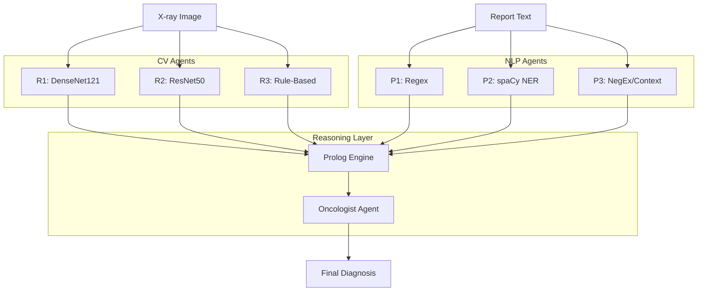
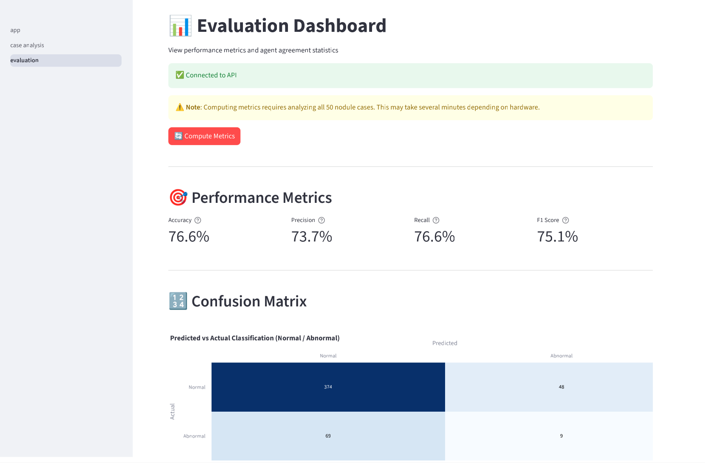
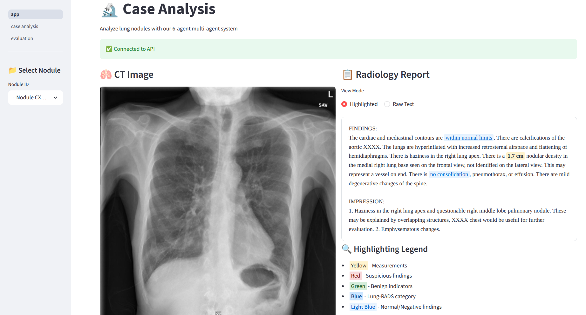
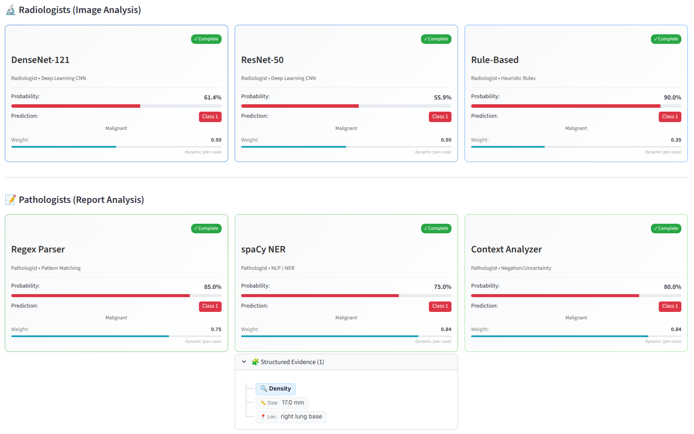
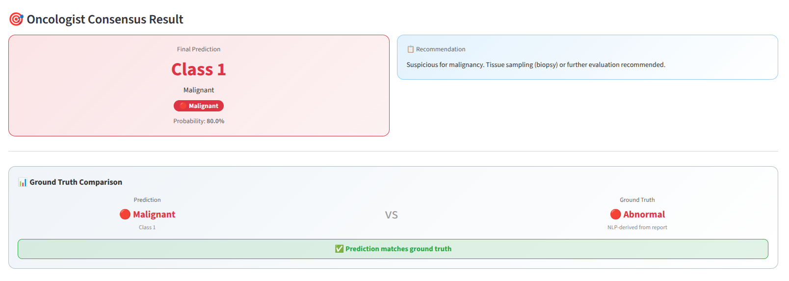
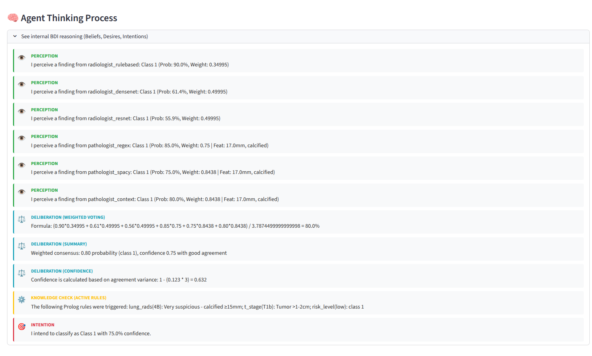
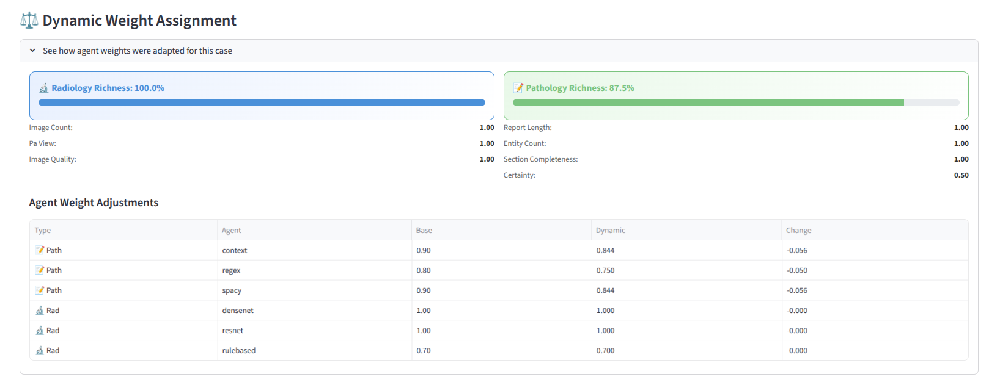

# BDI Multi-Agent System for Lung Nodule Evidence Extraction

**University of Genoa - Distributed Artificial Intelligence Project**

This project implements a **Belief-Desire-Intention (BDI) Multi-Agent System (MAS)** for extracting and fusing diagnostic evidence from chest X-ray images and radiology reports. It demonstrates the integration of **Deep Learning (Computer Vision)**, **Symbolic NLP**, and **Logic Programming (Prolog)** within a distributed agent architecture.

## Key Features

### 1. Neuro-Symbolic Architecture
- **Computer Vision**: `TorchXRayVision` (DenseNet/ResNet) for image analysis.
- **Symbolic NLP**: Custom pipeline with Regex, spaCy, and NegEx for text extraction.
- **Prolog Reasoning**: SWI-Prolog knowledge base for weighted consensus and conflict resolution.

### 2. Dynamic Per-Case Weighing
Unlike traditional systems with static weights, this MAS calculates a **Dynamic Richness Score** for each case. Agents operating on richer data (e.g., high-res PA views, detailed textual reports) are assigned higher influence in the final consensus.

### 3. Anatomically-Calibrated Size Estimation
The Rule-Based Radiologist (R3) uses a custom **blob detection algorithm** calibrated to a standard chest field-of-view (300mm) to estimate nodule size in millimeters, replacing naive pixel-based heuristics.

### 4. Dependency-Anchored NLP Frames
The spaCy Pathologist (P2) builds **structured finding frames** by traversing dependency trees, ensuring that attributes (size, location) are strictly associated with the correct nodule entity, resolving the "bag-of-words" problem in complex reports.

### 5. Provenance-Aware Consensus
Agents explicitly tag their findings with data sources (e.g., `size_source='regex'`). The consensus engine automatically down-weights agents that fail to find concrete measurements (`size_source='unknown'`), ensuring the final diagnosis is grounded in high-quality evidence.

## Architecture

The system follows a hub-and-spoke architecture where specialized agents report to a central Oncologist.



## Agents

### Radiologist Agents (Computer Vision)
| Agent | Model | Behavior |
|-------|-------|----------|
| **R1** | DenseNet121 | Conservative, high specificity |
| **R2** | ResNet50 | Balanced sensitivity/specificity |
| **R3** | Rule-Based | Heuristic (Size/Texture Analysis) |

### Pathologist Agents (NLP)
| Agent | Method | Focus |
|-------|--------|-------|
| **P1** | Regex | Fast, explicit pattern matching |
| **P2** | spaCy NER | Dependency parsing, frame building |
| **P3** | NegEx | Context (Negation/Uncertainty) detection |

### Oncologist Agent (Consensus)
- **Role**: Coordinator and decision maker.
- **Logic**: SWI-Prolog (via PySwip).
- **Functions**: Weighted voting, disagreement detection, clinical recommendation (Lung-RADS).

## User Interface

The system features a **Streamlit-based Dashboard** for interactive analysis and explainability.

### 1. Dashboard Overview
A dedicated dashboard tracks system performance, showing real-time metrics (Accuracy, Precision, Recall) and agreement statistics across the evaluation set.



### 2. Case Analysis
The core interface allows deep inspection of individual cases, visualizing both the X-ray image and the radiology report side-by-side.



### 3. Agent Results
Each agent (3 Radiologists, 3 Pathologists) displays its individual findings, confidence, and computed dynamic weight.



### 4. Consensus & Decision Making
The Oncologist agent aggregates these findings into a final diagnosis, providing a malignancy probability and a clinical recommendation.



### 5. Explainability Features
To build trust, the system exposes its internal reasoning:

**Agent Thinking Process**: A step-by-step log of the BDI reasoning loop (Perception $\to$ Deliberation $\to$ Intention).



**Dynamic Weight Assignment**: Quantifies how data richness (e.g., image quality, report detail) influences each agent's vote.



## Installation

### Prerequisites
- Python 3.8+
- SWI-Prolog ([Installation Guide](https://www.swi-prolog.org/Download.html))
- `git`

### Setup
```bash
# Clone the repository
git clone <repository_url>
cd lung_nodule_mas

# Create virtual environment
python -m venv venv
source venv/bin/activate  # Linux/Mac: source venv/bin/activate

# Install dependencies
pip install -r requirements.txt

# Install scispaCy model
pip install https://s3-us-west-2.amazonaws.com/ai2-s2-scispacy/releases/v0.5.1/en_core_sci_sm-0.5.1.tar.gz
```

> **Note**: `TorcXRayVision` will download pretrained weights (approx 100MB) on the first run.

## Usage

### 1. Extended Demo (Recommended)
Run the full 6-agent system on sample cases with detailed logging.
```bash
python main_extended.py --demo
```

### 2. SPADE-BDI Evaluation
Run the underlying SPADE-BDI agent system directly.
```bash
# Run on all available nodules
python spade_main.py --all

# Run with full evaluation metrics
python spade_main.py --evaluate

# Process a specific case
python spade_main.py --nodule nodule_001
```

### 3. Export Results
Generate a JSON report of the analysis.
```bash
python main_extended.py --evaluate --export results.json
```

## Dataset

This project uses the **Open-I Indiana University Chest X-ray Collection**.
- **Source**: [Open-I NIH](https://openi.nlm.nih.gov/)
- **Content**: 7,470 paired images and reports.
- **Evaluation Subset**: A filtered subset of 500 cases selected for high textual "richness".

To evaluate on the full dataset, ensure extraction is complete in `data/NLMCXR/`.

## Evaluation Results

Performance on the 500-case Evaluation Subset (NLP-derived Ground Truth):

| Metric | Score |
|--------|-------|
| **Binary Accuracy** | **76.6%** |
| Weighted Precision | 73.7% |
| Weighted Recall | 76.6% |
| Weighted F1 Score | 75.1% |
| Majority Agreement | 97.4% |

*Data based on 500-case evaluation run (Feb 2026).*

## Project Structure

```
lung_nodule_mas/
├── agents/             # BDI Agent implementations
│   ├── spade_radiologist.py
│   ├── spade_pathologist.py
│   └── spade_oncologist.py
├── asl/                # AgentSpeak(L) plans
│   ├── radiologist.asl
│   └── pathologist.asl
├── knowledge/          # Prolog Knowledge Base
│   ├── lung_rads.pl    # Clinical rules
│   └── prolog_engine.py
├── models/             # Deep Learning Models
│   ├── classifier.py   # DenseNet/ResNet wrappers
│   └── dynamic_weights.py # Richness score calculator
├── nlp/                # Natural Language Processing
│   ├── extractor.py    # Regex/spaCy extraction
│   └── negation_detector.py # NegEx implementation
├── data/               # Data loaders and parsers
├── report/             # LaTeX project report
├── main_extended.py    # Main CLI entry point
└── spade_main.py       # SPADE-BDI runner
```

## References
- **SPADE-BDI**: [https://github.com/javipalanca/spade_bdi](https://github.com/javipalanca/spade_bdi)
- **TorchXRayVision**: Cohen et al. (2022). [https://github.com/mlmed/torchxrayvision](https://github.com/mlmed/torchxrayvision)
- **scispaCy**: Neumann et al. (2019).
- **Lung-RADS**: American College of Radiology (v1.1).

---
*Educational Project - Not for Clinical Use*
