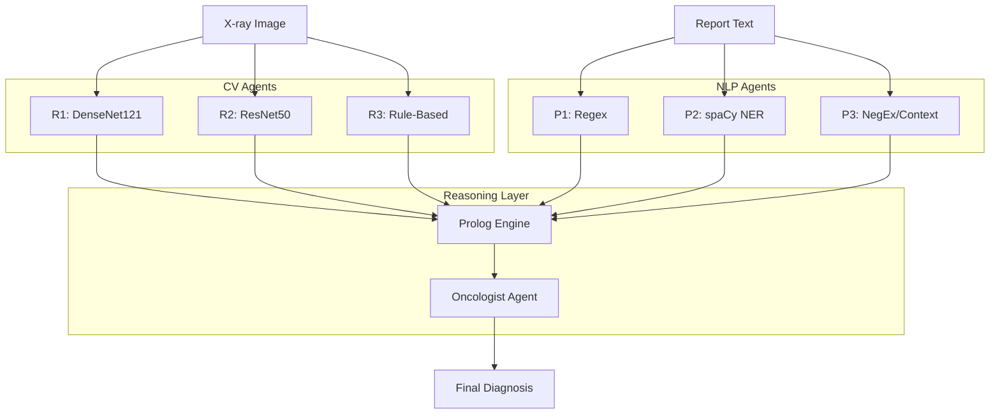

# BDI Multi-Agent System for Lung Nodule Evidence Extraction

**University of Genoa - Distributed Artificial Intelligence Project**

This project implements a **Belief-Desire-Intention (BDI) Multi-Agent System (MAS)** for extracting and fusing diagnostic evidence from chest X-ray images and radiology reports. It demonstrates the integration of **Deep Learning (Computer Vision)**, **Symbolic NLP**, and **Logic Programming (Prolog)** within a distributed agent architecture.

## Key Features

### 1. Neuro-Symbolic Architecture
- **Computer Vision**: `TorchXRayVision` (DenseNet/ResNet) for image analysis.
- **Symbolic NLP**: Custom pipeline with Regex, spaCy, and NegEx for text extraction.
- **Prolog Reasoning**: SWI-Prolog knowledge base for weighted consensus and conflict resolution.

### 2. Dynamic Per-Case Weighing
Unlike traditional systems with static weights, this MAS calculates a **Dynamic Richness Score** for each case. Agents operating on richer data (e.g., high-res PA views, detailed textual reports) are assigned higher influence in the final consensus.

### 3. Anatomically-Calibrated Size Estimation
The Rule-Based Radiologist (R3) uses a custom **blob detection algorithm** calibrated to a standard chest field-of-view (300mm) to estimate nodule size in millimeters, replacing naive pixel-based heuristics.

### 4. Dependency-Anchored NLP Frames
The spaCy Pathologist (P2) builds **structured finding frames** by traversing dependency trees, ensuring that attributes (size, location) are strictly associated with the correct nodule entity, resolving the "bag-of-words" problem in complex reports.

### 5. Provenance-Aware Consensus
Agents explicitly tag their findings with data sources (e.g., `size_source='regex'`). The consensus engine automatically down-weights agents that fail to find concrete measurements (`size_source='unknown'`), ensuring the final diagnosis is grounded in high-quality evidence.

## Architecture

The system follows a hub-and-spoke architecture where specialized agents report to a central Oncologist.



## Agents

### Radiologist Agents (Computer Vision)
| Agent | Model | Behavior |
|-------|-------|----------|
| **R1** | DenseNet121 | Conservative, high specificity |
| **R2** | ResNet50 | Balanced sensitivity/specificity |
| **R3** | Rule-Based | Heuristic (Size/Texture Analysis) |

### Pathologist Agents (NLP)
| Agent | Method | Focus |
|-------|--------|-------|
| **P1** | Regex | Fast, explicit pattern matching |
| **P2** | spaCy NER | Dependency parsing, frame building |
| **P3** | NegEx | Context (Negation/Uncertainty) detection |

### Oncologist Agent (Consensus)
- **Role**: Coordinator and decision maker.
- **Logic**: SWI-Prolog (via PySwip).
- **Functions**: Weighted voting, disagreement detection, clinical recommendation (Lung-RADS).

## User Interface

The system features a **Streamlit-based Dashboard** for interactive analysis and explainability.

### 1. Dashboard Overview
A dedicated dashboard tracks system performance, showing real-time metrics (Accuracy, Precision, Recall) and agreement statistics across the evaluation set.


### 2. Case Analysis
The core interface allows deep inspection of individual cases, visualizing both the X-ray image and the radiology report side-by-side.


### 3. Agent Results
Each agent (3 Radiologists, 3 Pathologists) displays its individual findings, confidence, and computed dynamic weight.


### 4. Consensus & Decision Making
The Oncologist agent aggregates these findings into a final diagnosis, providing a malignancy probability and a clinical recommendation.


### 5. Explainability Features
To build trust, the system exposes its internal reasoning:

**Agent Thinking Process**: A step-by-step log of the BDI reasoning loop (Perception $\to$ Deliberation $\to$ Intention).


**Dynamic Weight Assignment**: Quantifies how data richness (e.g., image quality, report detail) influences each agent's vote.


## Installation

### Prerequisites
- Python 3.8+
- SWI-Prolog ([Installation Guide](https://www.swi-prolog.org/Download.html))
- `git`

### Setup
```bash
# Clone the repository
git clone https://github.com/sepehrkdi/lung_nodule_mas.git
cd lung_nodule_mas

# Create virtual environment
python -m venv venv
source venv/bin/activate  # Linux/Mac: source venv/bin/activate

# Install dependencies
pip install -r requirements.txt

# Install scispaCy model
pip install https://s3-us-west-2.amazonaws.com/ai2-s2-scispacy/releases/v0.5.1/en_core_sci_sm-0.5.1.tar.gz
```

> **Note**: `TorcXRayVision` will download pretrained weights (approx 100MB) on the first run.

## Usage

### 1. Extended Demo (Recommended)
Run the full 6-agent system on sample cases with detailed logging.
```bash
python main_extended.py --demo
```

### 2. Export Results
Generate a JSON report of the analysis.
```bash
python main_extended.py --evaluate --export results.json
```

## Evaluation & Ablation Framework

The system includes a comprehensive evaluation framework for rigorous validation and ablation studies. This framework enables systematic comparison of architectural choices and verifies that each component contributes meaningfully to system performance.

### Quick Start

```bash
# Run full evaluation with 5-fold cross-validation
python main_extended.py --data nlmcxr --evaluate --cv-folds 5

# Run baseline comparison
python main_extended.py --data nlmcxr --run-baselines

# Run full ablation study
python main_extended.py --data nlmcxr --run-ablations

# Verify architectural claims
python main_extended.py --data nlmcxr --verify-claims
```

### CLI Options

| Flag | Description | Values |
|------|-------------|--------|
| `--no-filter` | Disable NLP richness filtering (evaluate ALL cases) | - |
| `--weight-mode` | Agent weighting strategy | `dynamic`, `static`, `equal` |
| `--consensus` | Consensus engine backend | `prolog`, `python` |
| `--no-negex` | Disable NegEx negation detection | - |
| `--no-dependency-parsing` | Disable dependency parsing in NLP | - |
| `--cv-folds N` | Run N-fold cross-validation | Integer (e.g., 5, 10) |
| `--run-baselines` | Run all baseline predictors | - |
| `--run-ablations` | Run full ablation study | - |
| `--verify-claims` | Run claim verification matrix | - |
| `--single-agent` | Use only one agent (ablation) | `R1`, `R2`, `R3`, `P1`, `P2`, `P3` |

### Baseline Predictors

The framework includes mandatory baselines for fair comparison:

| Baseline | Description |
|----------|-------------|
| **Majority Class** | Always predicts the most frequent class |
| **Random** | Random predictions with class prior |
| **Single Agent** | Individual agent predictions (R1, R2, R3, P1, P2, P3) |
| **Unweighted Majority Vote** | Simple majority across all 6 agents |
| **Static Weighted Average** | Fixed weights (no dynamic adjustment) |
| **sklearn Voting** | Industry-standard voting classifier |
| **Pure Python Average** | Python-only weighted average (no Prolog) |

### Ablation Categories

#### 1. Agent Ablations
Test whether all 6 agents are necessary:
```bash
# Remove one radiologist
python main_extended.py --evaluate --single-agent R1

# Compare: Full system vs 3-agent subset
```

#### 2. Weighting Ablations
Compare weighting strategies:
```bash
# Dynamic weights (default - learned from data richness)
python main_extended.py --evaluate --weight-mode dynamic

# Static weights (fixed expert-assigned)
python main_extended.py --evaluate --weight-mode static

# Equal weights (uniform 1/6 each)
python main_extended.py --evaluate --weight-mode equal
```

#### 3. Symbolic Layer Ablations
Test Prolog contribution:
```bash
# With Prolog consensus (default)
python main_extended.py --evaluate --consensus prolog

# Python-only consensus (ablation)
python main_extended.py --evaluate --consensus python
```

#### 4. NLP Ablations
Test NLP component contributions:
```bash
# Without NegEx
python main_extended.py --evaluate --no-negex

# Without dependency parsing
python main_extended.py --evaluate --no-dependency-parsing
```

### Evaluation Integrity

To ensure fair evaluation, the framework addresses potential biases:

1. **NLP Richness Filtering**: By default, cases are filtered by "NLP richness score" to select those with extractable content. Use `--no-filter` to evaluate on ALL cases.

2. **Cross-Validation**: Use `--cv-folds 5` for proper train/test splits with confidence intervals.

3. **PR-AUC Metric**: For imbalanced data (~85% benign), PR-AUC is reported alongside ROC-AUC.

4. **Statistical Tests**: McNemar's test, bootstrap confidence intervals, and Cohen's d effect sizes are computed for model comparisons.

### Claim Verification Matrix

The `--verify-claims` flag runs automated verification of architectural claims:

| Claim | Test |
|-------|------|
| Multi-agent > Single-agent | Best single agent vs full ensemble |
| Dynamic > Static weights | Dynamic weighting accuracy gain |
| Prolog ≈ Python consensus | Equivalence within tolerance |
| NegEx contribution | F1 delta with/without NegEx |
| Dependency parsing value | F1 delta with/without parsing |
| Ensemble improves recall | Recall comparison vs best single |
| System beats majority baseline | Accuracy over naive predictor |
| Per-class metrics fair | Recall balance across classes |

### Output Formats

Results are generated in multiple formats:
- **Markdown**: `results/baseline_comparison.md`, `results/ablation_results.md`
- **LaTeX**: `results/baseline_comparison.tex`, `results/ablation_results.tex`
- **JSON**: `results/all_results.json`
- **Console**: Real-time progress and summary statistics

### Example: Full Evaluation Pipeline

```bash
# 1. Run baselines
python main_extended.py --data nlmcxr --run-baselines --max-cases 500

# 2. Run main system with CV
python main_extended.py --data nlmcxr --evaluate --cv-folds 5 --max-cases 500

# 3. Run ablations
python main_extended.py --data nlmcxr --run-ablations --max-cases 500

# 4. Verify claims
python main_extended.py --data nlmcxr --verify-claims

# 5. Export all results
python main_extended.py --data nlmcxr --evaluate --export full_results.json
```

## Dataset

This project uses the **Open-I Indiana University Chest X-ray Collection**.
- **Source**: [Open-I NIH](https://openi.nlm.nih.gov/)
- **Content**: 7,470 paired images and reports.
- **Evaluation Subset**: A filtered subset of 500 cases selected for high textual "richness".

To evaluate on the full dataset, ensure extraction is complete in `data/NLMCXR/`.


1.  **Download**: Get the dataset directly from the Open-I archives:
    *   **Reports**: [`NLMCXR_reports.tgz`](https://openi.nlm.nih.gov/imgs/collections/NLMCXR_reports.tgz)
    *   **Images**: [`NLMCXR_png.tgz`](https://openi.nlm.nih.gov/imgs/collections/NLMCXR_png.tgz) (approx. 10 GB)
    
    You can use `wget`:
    ```bash
    wget https://openi.nlm.nih.gov/imgs/collections/NLMCXR_reports.tgz
    wget https://openi.nlm.nih.gov/imgs/collections/NLMCXR_png.tgz
    ```

2.  **Place**: Move these `.tgz` files into the `data/NLMCXR/` directory.
3.  **Extract**: Run the extraction script:
    ```bash
    python data/extract_nlmcxr.py
    ```


## Evaluation Results

Performance on the 500-case Evaluation Subset (NLP-derived Ground Truth):

| Metric | Score |
|--------|-------|
| **Binary Accuracy** | **76.6%** |
| Weighted Precision | 73.7% |
| Weighted Recall | 76.6% |
| Weighted F1 Score | 75.1% |
| Majority Agreement | 97.4% |

*Data based on 500-case evaluation run (Feb 2026).*

## Project Structure

```
lung_nodule_mas/
├── agents/             # BDI Agent implementations
│   ├── spade_radiologist.py
│   ├── spade_pathologist.py
│   └── spade_oncologist.py
├── asl/                # AgentSpeak(L) plans
│   ├── radiologist.asl
│   └── pathologist.asl
├── knowledge/          # Prolog Knowledge Base
│   ├── lung_rads.pl    # Clinical rules
│   ├── multi_agent_consensus.pl
│   └── prolog_engine.py
├── models/             # Deep Learning Models
│   ├── classifier.py   # DenseNet/ResNet wrappers
│   ├── dynamic_weights.py # Richness score calculator
│   └── python_consensus.py # Python consensus (for ablation)
├── nlp/                # Natural Language Processing
│   ├── extractor.py    # Regex/spaCy extraction
│   └── negation_detector.py # NegEx implementation
├── evaluation/         # Evaluation Framework
│   ├── metrics.py      # Classification metrics + PR-AUC
│   ├── baselines.py    # Baseline predictors
│   ├── cross_validation.py # Stratified K-fold CV
│   ├── statistical_tests.py # McNemar, bootstrap CI
│   ├── ablation_framework.py # Ablation study runner
│   ├── claim_verification.py # Architectural claim tests
│   └── results_generator.py # Markdown/LaTeX/JSON output
├── data/               # Data loaders and parsers
│   ├── nlmcxr_loader.py # NLMCXR dataset loader
│   └── nlmcxr_parser.py # XML report parser
├── results/            # Generated evaluation results
├── report/             # LaTeX project report
├── config.py           # Central configuration
├── main_extended.py    # Main CLI entry point
└── spade_main.py       # SPADE-BDI runner
```

## References
- **SPADE-BDI**: [https://github.com/javipalanca/spade_bdi](https://github.com/javipalanca/spade_bdi)
- **TorchXRayVision**: Cohen et al. (2022). [https://github.com/mlmed/torchxrayvision](https://github.com/mlmed/torchxrayvision)
- **scispaCy**: Neumann et al. (2019).
- **Lung-RADS**: American College of Radiology (v1.1).

---
*Educational Project - Not for Clinical Use*
